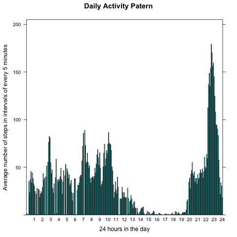
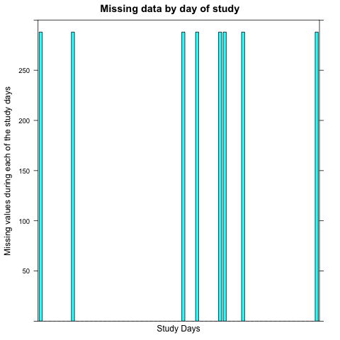
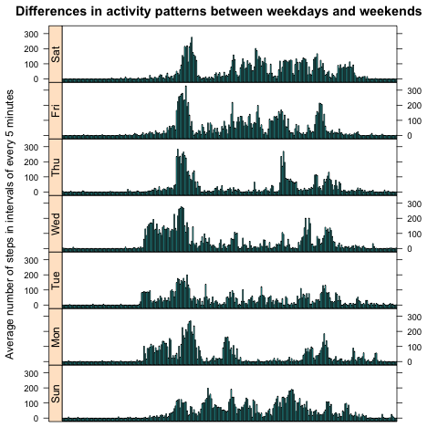

---
# Reproducible Research: Peer Assessment 1
________________
## [Rafael Reséndiz Ramírez] (https://github.com/Rafael-Resendiz)
### [PA1_template.Rmd] (https://github.com/Rafael-Resendiz/RepData_PeerAssessment1/edit/master/PA1_template.Rmd)


---


## Loading and preprocessing the data
Show any code that is needed to

Load the data (i.e. read.csv())

Process/transform the data (if necessary) into a format suitable for your analysis  
```{r readdata}
     fileUrl <- "https://d396qusza40orc.cloudfront.net/repdata%2Fdata%2Factivity.zip?accessType=DOWNLOAD"  
     download.file(fileUrl, destfile = "/Users/administrador/Specialization/Activity_monitoring_data.zip", 
     method = "curl")    
````
unzip the file    
```{r readdata2}
     unzip("Activity_monitoring_data.zip")  
````
Read the file   
```{r readdata3}
     activity <- read.table("/Users/administrador/Specialization/activity.csv", sep = ",", header = TRUE)  
```
Show the head file
```{r readdata4}
     head(activity)    
````
Stream the databases
```{r readdata5}
     str(activity)   
```
         

## What is mean total number of steps taken per day?

The *xtabs* and *mean* function can be used to determine the mean total number of steps taken per day

```{r xtabs}
     totalNumberSteps <- xtabs(steps ~ date,activity)

     mean(totalNumberSteps)  
```

Other way
Just to check the total number of steps per day are being calculated correctly, we sum the steps for days explicitly
 and dividing that number by the total number of days.
 ```{r axplicitsum}
      sum(activity$steps, na.rm=TRUE)/length(levels(activity$date)) 
```
         
 
 
 


## What is the average daily activity pattern?

The dayli activity pattern is defined by the interval

```{r pattern}
     average <- xtabs(activity$steps ~ activity$interval)/xtabs(~ activity$interval)
     summary(as.numeric(average))   
```
Plot 
         
```{r barplot,fig.align='center',fig.height=4,fig.width=8}
library(lattice)
barchart(average ~ names(average),
xlab="24 hours in the day",ylab="Average number of steps in intervals of every 5 minutes",
ylim=c(0,205.),scales=list(x=list(at=seq(0,288,by=12),labels=c(0:24))), 
main = "Daily Activity Patern")
```
 

Saving the file
````{r savingbarplot}
 dev.copy(png, file="averageInterval.png", 
 height=480, 
 width=480,
 units = "px", 
 bg = "transparent")
 dev.off()
 ```

## Imputing missing values
As shown in the summary of "data frame" called "activity" there lost in the variable "distance" values​​, 
a total of "n" observations. The ratio is quite high. 

Therefore, you should observe the distribution of missing data per interval.

````{r barplot1,fig.align='center',fig.height=4,fig.width=8}
missdata <- xtabs(is.na(steps) ~ interval, activity)
barchart(missdata ~ names(missdata),xlab="24 hours in the day",
ylab="Average number of steps in intervals of every 5 minutes",
ylim=c(0,10),scales=list(x=list(at=seq(0,288,by=12),labels=c(0:24))),
main = "Daily Activity Patern (Missing Data)")
```

 

Saving the file
````{r savingbarplot1}
 dev.copy(png, file="missData.png", 
 height=480, 
 width=480,
 units = "px", 
 bg = "transparent")
 dev.off()
 ```


If needed 
````{r barplot2,fig.align='center',fig.height=4,fig.width=8}
missDatainday <- xtabs(is.na(steps) ~ date, activity)
barchart(missDatainday ~ names(missDatainday),xlab = "Study Days",
         ylab="Missing values during each of the study days",
         ylim=c(0,300),scales=list(x=list(draw=FALSE)), 
         main= "Missing data by day of study")
```
 

Saving the file
````{r savingbarplot2}
 dev.copy(png, file="missDatainday.png", 
 height=480, 
 width=480,
 units = "px", 
 bg = "transparent")
 dev.off()
 ```


The total days of study was 61, but data from 8 of those days were lost, 
to find the position of the missing data and their corresponding dates
of the procedure should be as follows:
````{r showmissingdays}
activity$wday <- factor(strptime(activity$date,"%Y-%m-%d")$wday,
labels=c("Sun","Mon","Tue","Wed","Thu","Fri","Sat"))
missingDays <- unique(subset(within(activity,{NAs <- is.na(steps)}),select = c(date,wday,NAs)))
subset(missingDays,NAs,select=-NAs)
````


## Are there differences in activity patterns between weekdays and weekends?

The differences in activity patterns between weekdays and weekends, 
you can see if the activity is fused to the day (omitting missing values​​) 
and then determine the average number of steps per interval the days of the week and compared with weekends. 

````{r barplot3,fig.align='center',fig.height=4,fig.width=8}
activityDifference <- merge(activity,missingDays)
missNonData <- na.omit(activityDifference)
averageIntervalDay <- xtabs(steps ~ interval+wday,missNonData)/xtabs(~interval+wday,missNonData)
dfrm <- as.data.frame(averageIntervalDay)
barchart(Freq ~ interval|wday,dfrm,layout=c(1,7),strip=FALSE,strip.left=TRUE,
ylab="Average number of steps in intervals of every 5 minutes",xlab=NULL,
scales=list(x=list(draw=FALSE)),
main= "Differences in activity patterns between weekdays and weekends")
```
 
Saving the file`
````{r savingbarplot3}
 dev.copy(png, file="plotdiference.png", 
 height=480, 
 width=480,
 units = "px", 
 bg = "transparent")
 dev.off()
 ```
